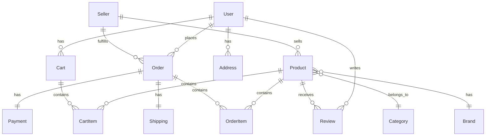

# Modelo de Dados - Marketplace

## Visão Geral

Este documento descreve o modelo de dados completo do marketplace, incluindo todas as tabelas, relacionamentos e campos necessários para o funcionamento do sistema.

## Diagrama ER Simplificado



## Tabelas Principais

### 1. Users (Usuários)
```typescript
interface User {
  id: string;                    // UUID
  email: string;                 // Único
  password_hash: string;         // Bcrypt hash
  full_name: string;
  phone?: string;
  cpf?: string;                  // Único, opcional
  role: 'customer' | 'seller' | 'admin';
  email_verified: boolean;
  created_at: Date;
  updated_at: Date;
  last_login?: Date;
  is_active: boolean;
}
```

### 2. Sellers (Vendedores)
```typescript
interface Seller {
  id: string;                    // UUID
  user_id: string;               // FK -> Users
  store_name: string;
  store_slug: string;            // Único, para URL
  cnpj?: string;                 // Único
  cpf?: string;                  // Para MEI
  description?: string;
  logo_url?: string;
  banner_url?: string;
  rating: number;                // 0-5
  total_sales: number;
  commission_rate: number;       // Percentual
  bank_account?: {
    bank_code: string;
    agency: string;
    account: string;
    account_type: string;
  };
  address: {
    street: string;
    number: string;
    complement?: string;
    neighborhood: string;
    city: string;
    state: string;
    zip_code: string;
  };
  is_verified: boolean;
  is_active: boolean;
  created_at: Date;
  updated_at: Date;
}
```

### 3. Categories (Categorias)
```typescript
interface Category {
  id: string;                    // UUID
  name: string;
  slug: string;                  // Único
  description?: string;
  parent_id?: string;            // FK -> Categories (auto-referência)
  icon_url?: string;
  image_url?: string;
  is_active: boolean;
  display_order: number;
  created_at: Date;
  updated_at: Date;
}
```

### 4. Brands (Marcas)
```typescript
interface Brand {
  id: string;                    // UUID
  name: string;
  slug: string;                  // Único
  logo_url?: string;
  website?: string;
  is_active: boolean;
  created_at: Date;
  updated_at: Date;
}
```

### 5. Products (Produtos)
```typescript
interface Product {
  id: string;                    // UUID
  seller_id: string;             // FK -> Sellers
  category_id: string;           // FK -> Categories
  brand_id?: string;             // FK -> Brands
  name: string;
  slug: string;                  // Único por vendedor
  description: string;
  short_description?: string;
  sku: string;                   // Único por vendedor
  barcode?: string;
  price: number;                 // Preço atual
  compare_at_price?: number;     // Preço anterior (para promoções)
  cost?: number;                 // Custo do produto
  currency: string;              // BRL
  weight?: number;               // Em gramas
  dimensions?: {
    length: number;              // Em cm
    width: number;
    height: number;
  };
  images: string[];              // Array de URLs
  thumbnail_url?: string;
  video_url?: string;
  tags: string[];
  attributes: Record<string, any>; // Atributos dinâmicos
  stock_quantity: number;
  stock_management: boolean;
  allow_backorder: boolean;
  is_digital: boolean;
  is_active: boolean;
  is_featured: boolean;
  rating: number;                // 0-5
  review_count: number;
  view_count: number;
  sales_count: number;
  created_at: Date;
  updated_at: Date;
  published_at?: Date;
}
```

### 6. ProductVariants (Variações de Produtos)
```typescript
interface ProductVariant {
  id: string;                    // UUID
  product_id: string;            // FK -> Products
  name: string;                  // Ex: "Tamanho M - Azul"
  sku: string;                   // Único
  price?: number;                // Se diferente do produto principal
  stock_quantity: number;
  attributes: {                  // Ex: { size: "M", color: "Azul" }
    [key: string]: string;
  };
  image_url?: string;
  is_active: boolean;
  created_at: Date;
  updated_at: Date;
}
```

### 7. Cart (Carrinho)
```typescript
interface Cart {
  id: string;                    // UUID
  user_id?: string;              // FK -> Users (opcional para visitantes)
  session_id?: string;           // Para carrinhos de visitantes
  items_count: number;
  subtotal: number;
  expires_at: Date;              // Para limpeza automática
  created_at: Date;
  updated_at: Date;
}
```

### 8. CartItems (Itens do Carrinho)
```typescript
interface CartItem {
  id: string;                    // UUID
  cart_id: string;               // FK -> Cart
  product_id: string;            // FK -> Products
  variant_id?: string;           // FK -> ProductVariants
  quantity: number;
  price: number;                 // Preço no momento da adição
  created_at: Date;
  updated_at: Date;
}
```

### 9. Orders (Pedidos)
```typescript
interface Order {
  id: string;                    // UUID
  order_number: string;          // Único, legível
  user_id: string;               // FK -> Users
  seller_id: string;             // FK -> Sellers
  status: OrderStatus;
  subtotal: number;
  shipping_cost: number;
  tax_amount: number;
  discount_amount: number;
  total: number;
  currency: string;              // BRL
  payment_status: PaymentStatus;
  shipping_status: ShippingStatus;
  customer_notes?: string;
  admin_notes?: string;
  shipping_address: Address;
  billing_address: Address;
  created_at: Date;
  updated_at: Date;
  paid_at?: Date;
  shipped_at?: Date;
  delivered_at?: Date;
  cancelled_at?: Date;
}

enum OrderStatus {
  PENDING = 'pending',
  PROCESSING = 'processing',
  SHIPPED = 'shipped',
  DELIVERED = 'delivered',
  CANCELLED = 'cancelled',
  REFUNDED = 'refunded'
}

enum PaymentStatus {
  PENDING = 'pending',
  PAID = 'paid',
  FAILED = 'failed',
  REFUNDED = 'refunded'
}

enum ShippingStatus {
  PENDING = 'pending',
  PROCESSING = 'processing',
  SHIPPED = 'shipped',
  IN_TRANSIT = 'in_transit',
  DELIVERED = 'delivered',
  RETURNED = 'returned'
}
```

### 10. OrderItems (Itens do Pedido)
```typescript
interface OrderItem {
  id: string;                    // UUID
  order_id: string;              // FK -> Orders
  product_id: string;            // FK -> Products
  variant_id?: string;           // FK -> ProductVariants
  product_name: string;          // Snapshot do nome
  product_sku: string;           // Snapshot do SKU
  quantity: number;
  price: number;                 // Preço unitário no momento
  total: number;                 // quantity * price
  created_at: Date;
  updated_at: Date;
}
```

### 11. Payments (Pagamentos)
```typescript
interface Payment {
  id: string;                    // UUID
  order_id: string;              // FK -> Orders
  method: PaymentMethod;
  status: PaymentStatus;
  amount: number;
  currency: string;
  gateway: string;               // stripe, pagarme, etc
  gateway_transaction_id?: string;
  gateway_response?: Record<string, any>;
  card_last_digits?: string;
  card_brand?: string;
  boleto_url?: string;
  boleto_barcode?: string;
  pix_qr_code?: string;
  pix_qr_code_url?: string;
  installments?: number;
  created_at: Date;
  updated_at: Date;
  paid_at?: Date;
  failed_at?: Date;
  refunded_at?: Date;
}

enum PaymentMethod {
  CREDIT_CARD = 'credit_card',
  DEBIT_CARD = 'debit_card',
  BOLETO = 'boleto',
  PIX = 'pix',
  BANK_TRANSFER = 'bank_transfer'
}
```

### 12. Shipping (Envios)
```typescript
interface Shipping {
  id: string;                    // UUID
  order_id: string;              // FK -> Orders
  carrier: string;               // Correios, Transportadora, etc
  service: string;               // PAC, SEDEX, etc
  tracking_code?: string;
  tracking_url?: string;
  estimated_delivery?: Date;
  actual_delivery?: Date;
  cost: number;
  status: ShippingStatus;
  events: ShippingEvent[];
  created_at: Date;
  updated_at: Date;
}

interface ShippingEvent {
  date: Date;
  status: string;
  description: string;
  location?: string;
}
```

### 13. Addresses (Endereços)
```typescript
interface Address {
  id: string;                    // UUID
  user_id: string;               // FK -> Users
  type: 'shipping' | 'billing';
  is_default: boolean;
  recipient_name: string;
  street: string;
  number: string;
  complement?: string;
  neighborhood: string;
  city: string;
  state: string;
  country: string;               // BR
  zip_code: string;
  phone?: string;
  created_at: Date;
  updated_at: Date;
}
```

### 14. Reviews (Avaliações)
```typescript
interface Review {
  id: string;                    // UUID
  product_id: string;            // FK -> Products
  user_id: string;               // FK -> Users
  order_id?: string;             // FK -> Orders
  rating: number;                // 1-5
  title?: string;
  comment?: string;
  images?: string[];
  is_verified_purchase: boolean;
  is_approved: boolean;
  helpful_count: number;
  created_at: Date;
  updated_at: Date;
}
```

### 15. Coupons (Cupons)
```typescript
interface Coupon {
  id: string;                    // UUID
  code: string;                  // Único
  description?: string;
  type: 'percentage' | 'fixed';
  value: number;
  minimum_amount?: number;
  maximum_discount?: number;
  usage_limit?: number;
  usage_count: number;
  user_limit?: number;           // Limite por usuário
  valid_from: Date;
  valid_until: Date;
  is_active: boolean;
  applicable_products?: string[]; // IDs de produtos
  applicable_categories?: string[]; // IDs de categorias
  applicable_sellers?: string[];  // IDs de vendedores
  created_at: Date;
  updated_at: Date;
}
```

### 16. Wishlists (Lista de Desejos)
```typescript
interface Wishlist {
  id: string;                    // UUID
  user_id: string;               // FK -> Users
  product_id: string;            // FK -> Products
  created_at: Date;
}
```

### 17. Notifications (Notificações)
```typescript
interface Notification {
  id: string;                    // UUID
  user_id: string;               // FK -> Users
  type: NotificationType;
  title: string;
  message: string;
  data?: Record<string, any>;
  is_read: boolean;
  read_at?: Date;
  created_at: Date;
}

enum NotificationType {
  ORDER_PLACED = 'order_placed',
  ORDER_SHIPPED = 'order_shipped',
  ORDER_DELIVERED = 'order_delivered',
  PAYMENT_RECEIVED = 'payment_received',
  REVIEW_RECEIVED = 'review_received',
  PRODUCT_BACK_IN_STOCK = 'product_back_in_stock',
  PROMOTION = 'promotion'
}
```

## Índices Recomendados

### Performance
- `users.email` (único)
- `sellers.user_id`
- `sellers.store_slug` (único)
- `products.seller_id`
- `products.category_id`
- `products.slug` + `products.seller_id` (composto, único)
- `orders.user_id`
- `orders.seller_id`
- `orders.order_number` (único)
- `order_items.order_id`
- `cart_items.cart_id`

### Busca e Filtros
- `products.name` (full-text search)
- `products.description` (full-text search)
- `products.tags` (array index)
- `products.price`
- `products.created_at`
- `products.is_active` + `products.published_at`

## Considerações de Segurança

1. **Dados Sensíveis**: Nunca expor `password_hash`, `cpf`, `cnpj` nas APIs públicas
2. **Soft Delete**: Implementar soft delete para dados críticos (orders, payments)
3. **Auditoria**: Manter logs de alterações em tabelas críticas
4. **Criptografia**: Criptografar dados de pagamento e informações pessoais sensíveis

## Migrations

As migrations devem ser versionadas e executadas em ordem. Usar ferramentas como:
- Xata CLI para gerenciar schema
- Scripts SQL versionados
- Rollback strategies para cada migration 