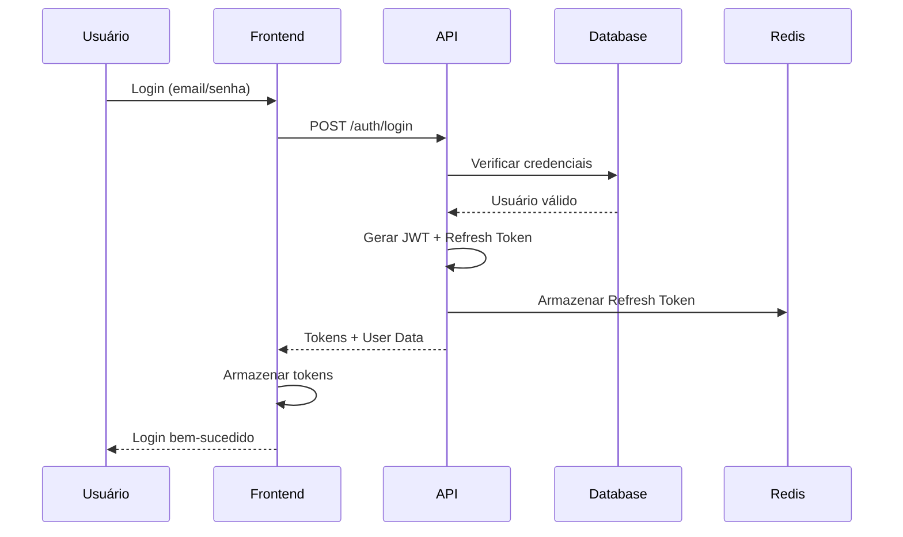

# Autenticação e Autorização - Marketplace GDG

## Visão Geral

O sistema de autenticação e autorização do Marketplace GDG é baseado em JWT (JSON Web Tokens) com refresh tokens, implementando segurança em múltiplas camadas e suportando diferentes tipos de usuários (clientes, vendedores e administradores).

## Arquitetura de Autenticação

### Fluxo de Autenticação



### Tokens

#### Access Token (JWT)
- **Duração**: 15 minutos
- **Armazenamento**: Cookie httpOnly + secure
- **Conteúdo**: ID do usuário, role, permissões básicas

#### Refresh Token
- **Duração**: 7 dias
- **Armazenamento**: Cookie httpOnly + secure separado
- **Uso**: Renovar access token expirado

## Implementação

### 1. Configuração Base

```typescript
// src/lib/auth/config.ts
export const authConfig = {
  jwt: {
    secret: process.env.JWT_SECRET!,
    accessTokenExpiry: '15m',
    refreshTokenExpiry: '7d',
    issuer: 'marketplace-gdg',
    audience: 'marketplace-users'
  },
  cookies: {
    access: {
      name: '__marketplace_access',
      httpOnly: true,
      secure: true,
      sameSite: 'lax' as const,
      path: '/',
      maxAge: 15 * 60 // 15 minutos
    },
    refresh: {
      name: '__marketplace_refresh',
      httpOnly: true,
      secure: true,
      sameSite: 'lax' as const,
      path: '/auth/refresh',
      maxAge: 7 * 24 * 60 * 60 // 7 dias
    }
  }
};
```

### 2. Geração de Tokens

```typescript
// src/lib/auth/tokens.ts
import jwt from 'jsonwebtoken';
import { nanoid } from 'nanoid';
import type { User } from '$lib/types';

export interface TokenPayload {
  sub: string; // user ID
  email: string;
  role: 'customer' | 'seller' | 'admin';
  permissions: string[];
  iat?: number;
  exp?: number;
}

export function generateAccessToken(user: User): string {
  const payload: TokenPayload = {
    sub: user.id,
    email: user.email,
    role: user.role,
    permissions: getUserPermissions(user)
  };

  return jwt.sign(payload, authConfig.jwt.secret, {
    expiresIn: authConfig.jwt.accessTokenExpiry,
    issuer: authConfig.jwt.issuer,
    audience: authConfig.jwt.audience
  });
}

export function generateRefreshToken(): string {
  return nanoid(32);
}

export async function verifyAccessToken(token: string): Promise<TokenPayload> {
  try {
    return jwt.verify(token, authConfig.jwt.secret, {
      issuer: authConfig.jwt.issuer,
      audience: authConfig.jwt.audience
    }) as TokenPayload;
  } catch (error) {
    throw new UnauthorizedError('Token inválido ou expirado');
  }
}
```

### 3. Serviço de Autenticação

```typescript
// src/lib/auth/authService.ts
import bcrypt from 'bcrypt';
import { xata } from '$lib/xata';
import { redis } from '$lib/redis';
import type { LoginDTO, RegisterDTO } from '$lib/types';

export class AuthService {
  async register(data: RegisterDTO) {
    // Verificar se email já existe
    const existingUser = await xata.db.users
      .filter({ email: data.email })
      .getFirst();
    
    if (existingUser) {
      throw new ConflictError('Email já cadastrado');
    }

    // Hash da senha
    const passwordHash = await bcrypt.hash(data.password, 12);

    // Criar usuário
    const user = await xata.db.users.create({
      ...data,
      password_hash: passwordHash,
      role: 'customer',
      email_verified: false,
      created_at: new Date()
    });

    // Enviar email de verificação
    await this.sendVerificationEmail(user);

    return {
      user: this.sanitizeUser(user),
      tokens: await this.generateTokens(user)
    };
  }

  async login(credentials: LoginDTO) {
    // Buscar usuário
    const user = await xata.db.users
      .filter({ email: credentials.email })
      .getFirst();

    if (!user) {
      throw new UnauthorizedError('Credenciais inválidas');
    }

    // Verificar senha
    const validPassword = await bcrypt.compare(
      credentials.password,
      user.password_hash
    );

    if (!validPassword) {
      throw new UnauthorizedError('Credenciais inválidas');
    }

    // Verificar se conta está ativa
    if (!user.is_active) {
      throw new ForbiddenError('Conta desativada');
    }

    // Atualizar último login
    await xata.db.users.update(user.id, {
      last_login: new Date()
    });

    return {
      user: this.sanitizeUser(user),
      tokens: await this.generateTokens(user)
    };
  }

  async refresh(refreshToken: string) {
    // Verificar refresh token no Redis
    const userId = await redis.get(`refresh:${refreshToken}`);
    
    if (!userId) {
      throw new UnauthorizedError('Refresh token inválido');
    }

    // Buscar usuário
    const user = await xata.db.users.read(userId);
    
    if (!user || !user.is_active) {
      throw new UnauthorizedError('Usuário não encontrado ou inativo');
    }

    // Gerar novos tokens
    const tokens = await this.generateTokens(user);

    // Invalidar refresh token antigo
    await redis.del(`refresh:${refreshToken}`);

    return {
      user: this.sanitizeUser(user),
      tokens
    };
  }

  async logout(refreshToken: string) {
    // Remover refresh token do Redis
    await redis.del(`refresh:${refreshToken}`);
  }

  private async generateTokens(user: User) {
    const accessToken = generateAccessToken(user);
    const refreshToken = generateRefreshToken();

    // Armazenar refresh token no Redis
    await redis.set(
      `refresh:${refreshToken}`,
      user.id,
      'EX',
      7 * 24 * 60 * 60 // 7 dias
    );

    return { accessToken, refreshToken };
  }

  private sanitizeUser(user: User) {
    const { password_hash, ...sanitized } = user;
    return sanitized;
  }
}

export const authService = new AuthService();
```

### 4. Middleware de Autenticação

```typescript
// src/hooks.server.ts
import type { Handle } from '@sveltejs/kit';
import { verifyAccessToken } from '$lib/auth/tokens';
import { xata } from '$lib/xata';

export const handle: Handle = async ({ event, resolve }) => {
  // Extrair token do cookie
  const token = event.cookies.get(authConfig.cookies.access.name);

  if (token) {
    try {
      // Verificar e decodificar token
      const payload = await verifyAccessToken(token);
      
      // Buscar usuário completo se necessário
      const user = await xata.db.users.read(payload.sub);
      
      if (user && user.is_active) {
        event.locals.user = user;
        event.locals.permissions = payload.permissions;
      }
    } catch (error) {
      // Token inválido - limpar cookie
      event.cookies.delete(authConfig.cookies.access.name);
    }
  }

  // Adicionar headers de segurança
  const response = await resolve(event);
  
  response.headers.set('X-Frame-Options', 'DENY');
  response.headers.set('X-Content-Type-Options', 'nosniff');
  response.headers.set('Referrer-Policy', 'strict-origin-when-cross-origin');
  
  return response;
};
```

### 5. Guards de Autorização

```typescript
// src/lib/auth/guards.ts
import { error, redirect } from '@sveltejs/kit';
import type { User } from '$lib/types';

export function requireAuth(user: User | null, url: URL) {
  if (!user) {
    throw redirect(303, `/login?redirect=${encodeURIComponent(url.pathname)}`);
  }
  return user;
}

export function requireRole(user: User | null, role: string | string[]) {
  const validUser = requireAuth(user);
  const roles = Array.isArray(role) ? role : [role];
  
  if (!roles.includes(validUser.role)) {
    throw error(403, 'Acesso negado');
  }
  
  return validUser;
}

export function requirePermission(
  user: User | null,
  permissions: string[],
  permission: string
) {
  requireAuth(user);
  
  if (!permissions.includes(permission)) {
    throw error(403, 'Permissão insuficiente');
  }
}

// Uso em +page.server.ts
export const load: PageServerLoad = async ({ locals, url }) => {
  const user = requireRole(locals.user, ['admin', 'seller']);
  
  // Lógica específica da página
  return {
    user
  };
};
```

## Sistema de Permissões

### Roles e Permissões

```typescript
// src/lib/auth/permissions.ts
export const PERMISSIONS = {
  // Produtos
  PRODUCT_CREATE: 'product:create',
  PRODUCT_UPDATE: 'product:update',
  PRODUCT_DELETE: 'product:delete',
  PRODUCT_VIEW_ALL: 'product:view:all',
  
  // Pedidos
  ORDER_VIEW_ALL: 'order:view:all',
  ORDER_UPDATE_STATUS: 'order:update:status',
  ORDER_CANCEL: 'order:cancel',
  
  // Usuários
  USER_VIEW_ALL: 'user:view:all',
  USER_UPDATE: 'user:update',
  USER_DELETE: 'user:delete',
  
  // Vendedores
  SELLER_APPROVE: 'seller:approve',
  SELLER_SUSPEND: 'seller:suspend',
  
  // Sistema
  SYSTEM_CONFIG: 'system:config',
  ANALYTICS_VIEW: 'analytics:view'
} as const;

export const ROLE_PERMISSIONS: Record<string, string[]> = {
  customer: [
    // Clientes podem apenas gerenciar seus próprios recursos
  ],
  
  seller: [
    PERMISSIONS.PRODUCT_CREATE,
    PERMISSIONS.PRODUCT_UPDATE,
    PERMISSIONS.PRODUCT_DELETE,
    PERMISSIONS.ORDER_UPDATE_STATUS,
    PERMISSIONS.ANALYTICS_VIEW
  ],
  
  admin: [
    // Admin tem todas as permissões
    ...Object.values(PERMISSIONS)
  ]
};

export function getUserPermissions(user: User): string[] {
  const basePermissions = ROLE_PERMISSIONS[user.role] || [];
  
  // Adicionar permissões customizadas se existirem
  if (user.custom_permissions) {
    return [...new Set([...basePermissions, ...user.custom_permissions])];
  }
  
  return basePermissions;
}
```

### Verificação de Permissões em Componentes

```svelte
<!-- src/lib/components/PermissionGate.svelte -->
<script lang="ts">
  import { page } from '$app/stores';
  
  export let permission: string;
  export let fallback: 'hide' | 'disable' = 'hide';
  
  $: hasPermission = $page.data.permissions?.includes(permission) ?? false;
</script>

{#if hasPermission}
  <slot />
{:else if fallback === 'disable'}
  <div class="opacity-50 pointer-events-none">
    <slot />
  </div>
{/if}

<!-- Uso -->
<PermissionGate permission="product:delete">
  <button on:click={deleteProduct}>Deletar Produto</button>
</PermissionGate>
```

## Segurança Adicional

### 1. Rate Limiting

```typescript
// src/lib/auth/rateLimiter.ts
import { RateLimiter } from '@upstash/ratelimit';
import { redis } from '$lib/redis';

export const loginLimiter = new RateLimiter({
  redis,
  limiter: RateLimiter.slidingWindow(5, '15m'), // 5 tentativas em 15 minutos
  analytics: true
});

// Uso no endpoint de login
export const POST: RequestHandler = async ({ request, getClientAddress }) => {
  const ip = getClientAddress();
  const { success } = await loginLimiter.limit(ip);
  
  if (!success) {
    return json(
      { error: 'Muitas tentativas. Tente novamente mais tarde.' },
      { status: 429 }
    );
  }
  
  // Processar login...
};
```

### 2. Two-Factor Authentication (2FA)

```typescript
// src/lib/auth/twoFactor.ts
import speakeasy from 'speakeasy';
import QRCode from 'qrcode';

export async function generateTwoFactorSecret(user: User) {
  const secret = speakeasy.generateSecret({
    name: `Marketplace (${user.email})`,
    issuer: 'Marketplace GDG'
  });
  
  const qrCodeUrl = await QRCode.toDataURL(secret.otpauth_url!);
  
  // Salvar secret criptografado no banco
  await xata.db.users.update(user.id, {
    two_factor_secret: encrypt(secret.base32),
    two_factor_enabled: false
  });
  
  return {
    secret: secret.base32,
    qrCode: qrCodeUrl
  };
}

export function verifyTwoFactorToken(secret: string, token: string): boolean {
  return speakeasy.totp.verify({
    secret,
    encoding: 'base32',
    token,
    window: 2 // Permite 2 intervalos de diferença
  });
}
```

### 3. Session Management

```typescript
// src/lib/auth/sessions.ts
export class SessionManager {
  async createSession(userId: string, metadata: SessionMetadata) {
    const sessionId = nanoid();
    
    await redis.hset(`session:${sessionId}`, {
      userId,
      createdAt: Date.now(),
      lastActivity: Date.now(),
      ...metadata
    });
    
    // Adicionar à lista de sessões do usuário
    await redis.sadd(`user:${userId}:sessions`, sessionId);
    
    // Expirar em 30 dias
    await redis.expire(`session:${sessionId}`, 30 * 24 * 60 * 60);
    
    return sessionId;
  }
  
  async invalidateAllSessions(userId: string) {
    const sessions = await redis.smembers(`user:${userId}:sessions`);
    
    for (const sessionId of sessions) {
      await redis.del(`session:${sessionId}`);
    }
    
    await redis.del(`user:${userId}:sessions`);
  }
}
```

## Endpoints de Autenticação

### POST /auth/register
```typescript
// src/routes/auth/register/+server.ts
import { json } from '@sveltejs/kit';
import { authService } from '$lib/auth/authService';
import { registerSchema } from '$lib/validations';

export const POST: RequestHandler = async ({ request, cookies }) => {
  try {
    const data = await request.json();
    const validated = registerSchema.parse(data);
    
    const { user, tokens } = await authService.register(validated);
    
    // Definir cookies
    cookies.set(
      authConfig.cookies.access.name,
      tokens.accessToken,
      authConfig.cookies.access
    );
    
    cookies.set(
      authConfig.cookies.refresh.name,
      tokens.refreshToken,
      authConfig.cookies.refresh
    );
    
    return json({ success: true, data: { user } });
  } catch (error) {
    return handleAuthError(error);
  }
};
```

### POST /auth/login
```typescript
// src/routes/auth/login/+server.ts
export const POST: RequestHandler = async ({ request, cookies }) => {
  try {
    const data = await request.json();
    const validated = loginSchema.parse(data);
    
    const { user, tokens } = await authService.login(validated);
    
    // Definir cookies
    cookies.set(
      authConfig.cookies.access.name,
      tokens.accessToken,
      authConfig.cookies.access
    );
    
    cookies.set(
      authConfig.cookies.refresh.name,
      tokens.refreshToken,
      authConfig.cookies.refresh
    );
    
    return json({ success: true, data: { user } });
  } catch (error) {
    return handleAuthError(error);
  }
};
```

### POST /auth/refresh
```typescript
// src/routes/auth/refresh/+server.ts
export const POST: RequestHandler = async ({ cookies }) => {
  try {
    const refreshToken = cookies.get(authConfig.cookies.refresh.name);
    
    if (!refreshToken) {
      throw new UnauthorizedError('Refresh token não encontrado');
    }
    
    const { user, tokens } = await authService.refresh(refreshToken);
    
    // Atualizar cookies
    cookies.set(
      authConfig.cookies.access.name,
      tokens.accessToken,
      authConfig.cookies.access
    );
    
    cookies.set(
      authConfig.cookies.refresh.name,
      tokens.refreshToken,
      authConfig.cookies.refresh
    );
    
    return json({ success: true, data: { user } });
  } catch (error) {
    return handleAuthError(error);
  }
};
```

## Boas Práticas de Segurança

1. **Senhas Fortes**: Mínimo 8 caracteres, com letras, números e símbolos
2. **Hashing Seguro**: Bcrypt com salt rounds >= 12
3. **HTTPS Obrigatório**: Todos os cookies com flag `secure`
4. **CSRF Protection**: Tokens CSRF para formulários
5. **XSS Prevention**: Sanitização de inputs e outputs
6. **SQL Injection**: Uso de prepared statements (Xata cuida disso)
7. **Auditoria**: Log de todas as ações sensíveis
8. **Expiração de Sessão**: Tokens com tempo de vida curto
9. **Revogação de Acesso**: Capacidade de invalidar tokens/sessões
10. **Monitoramento**: Alertas para atividades suspeitas 